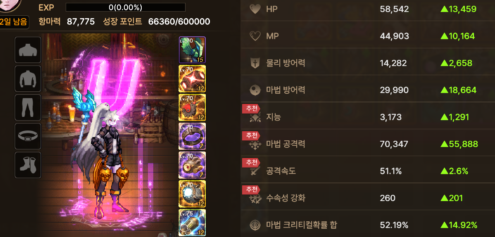
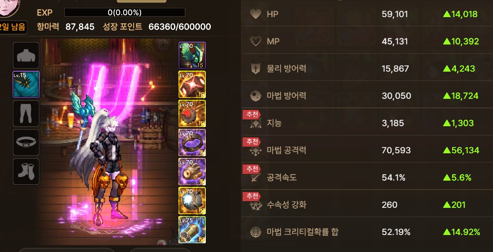
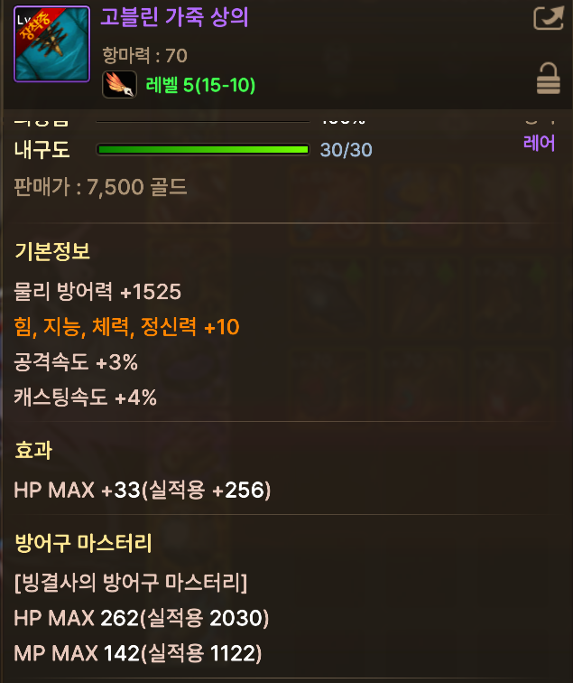

# 🐞 [BUG-001] 빙결사 가죽 방어구 마스터리 스탯 계수 미적용 결함

| 프로젝트 | 던전앤파이터 모바일 | 우선순위 | P1 (High) |
| :--- | :--- | :--- | :--- |
| **결함 유형** | 시스템 로직 (데이터 누락) | 발생 환경 | AOS, PC 공통 |
| **상태** | **Resolved (수정 완료)** | 담당자 | piko-0 (Analysis & Report) |

---

### 1. Summary (요약)
빙결사 캐릭터가 전용 방어구(가죽) 착용 시, 마스터리 패시브에 따른 물리 방어력 및 HP/MP 최대치 증가 보너스가 누락되는 현상.

### 2. Evidence Source (자료 출처 및 분석 방식)
* **결함 상태:** 본 결함은 업데이트 당시 발생했던 이슈로, 현재는 수정이 완료되었습니다.
* **분석 방식:** 직접적인 재현이 불가능하여 **당시 결함을 겪은 타 플레이어의 실제 검증 스크린샷을 인용**하여 QA 관점에서 데이터 분석을 재수행하였습니다.
* **Source:** [던전앤파이터 모바일 공식 커뮤니티 제보 게시글](https://dnfm.nexon.com/Community/Free/View/3356986)

### 3. Steps to Reproduce (재현 경로)
1. 빙결사 캐릭터로 접속하여 장비를 모두 해제한 기본 HP 확인.
2. 15레벨 가죽 방어구 착용 후 HP 및 상세 스탯 확인.
3. 25레벨 가죽 방어구로 교체 착용 후 HP 수치 비교.

### 4. Expected vs Actual (기대 결과 및 실제 결과)
* **기대 결과:** 방어구 레벨이 15Lv에서 25Lv로 상승함에 따라, 기본 스탯과 마스터리 가산 계수가 비례하여 상승해야 함.
* **실제 결과:** 25레벨 방어구 착용 시 15레벨 대비 오히려 최종 HP가 낮게 측정되는 **'스탯 역전 현상'** 발생.

### 5. QA Note (분석 의견)
* **결함 원인 추정:** 분석 결과, 방어구 자체 스탯은 상승했으나 **빙결사의 방어구 마스터리**가 정상적으로 적용되지 않습니다.
* **리스크 영향:** 캐릭터 생존력과 직결되는 스탯(HP/물방) 오류로, 고레벨 콘텐츠 진입 시 유저 경험에 치명적인 영향을 주는 P1급 결함으로 분류하였습니다.

### 6. Evidence (증거 자료)

#### [Step 01] 대조군: 장비 미착용 상태
| 기본 HP 수치 확인 (13,459) |
| :---: |
|  |

#### [Step 02] 정상군: 15레벨 가죽 상의 착용
| 15Lv 착용 HP (14,018) | 15Lv 마스터리 상세 정보 |
| :---: | :---: |
|  |  |
| **상승 확인** | **마스터리 적용 비활성화** |

#### [Step 03] 결함군: 25레벨 가죽 상의 착용 (데이터 역전)
| 25Lv 착용 HP (13,914) | 25Lv 마스터리 상세 정보 |
| :---: | :---: |
|  |  |
| **[결함] 15Lv 대비 낮은 수치** | **[결함] 계수 미적용 확신** |

---
[👈 Test Case (TC-08)로 이동](../Test_Case/DNF-M_Test_Case.md)
