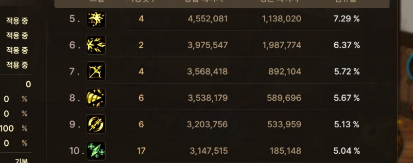
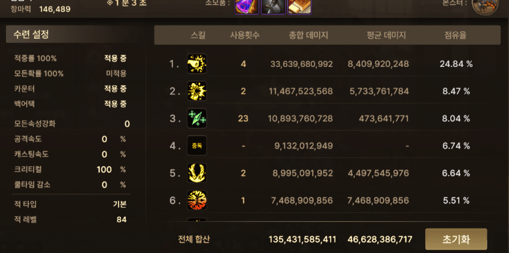

# 🐞 [BUG-002] 빙결사 '헤일스톰' 추가 타격 판정 소실 및 데미지 저하 결함

| 프로젝트 | 던전앤파이터 모바일 | 우선순위 | P1 (High) |
| :--- | :--- | :--- | :--- |
| **결함 유형** | 전투 로직 (판정 오류) | 발생 환경 | AOS, PC 공통 |
| **상태** | **Resolved (수정 완료)** | 담당자 | piko-0 (Analysis & Report) |

---

### 1. Summary (요약)
빙결사의 주력 스킬인 '헤일스톰' 시전 시, 추가 얼음 창의 타격 판정이 간헐적으로 소실되어 전체 데미지 점유율이 비정상적으로 낮게 측정되는 현상. (1/29 공식 패치로 수정 완료)

### 2. Evidence Source (자료 출처 및 분석 방식)
* **결함 상태:** 본 결함은 **1/23 패치로 이미 수정이 완료된 사항**입니다.
* **분석 방식:** 현재 환경에서는 결함 재현이 불가하므로, **패치 전 결함이 존재하던 시점의 실제 유저 검증 데이터(수련장 리포트)를 입수**하여 QA 관점에서 전/후 비교 분석을 수행하였습니다.
* **Source:** [던전앤파이터 모바일 공식 커뮤니티 제보 게시글]((https://gall.dcinside.com/mgallery/board/view/?id=dnfm&no=2069967)

### 3. Steps to Reproduce (재현 경로 - 패치 전 기준)
1. 빙결사 캐릭터로 수련장(샌드백 - 거대누골) 입장.
2. 1분동안 스킬 사이클 시전.
3. 데미지 리포트(딜표)를 열어 '헤일스톰'의 평균 데미지 및 전체 점유율 확인.

### 4. Expected vs Actual (기대 결과 및 실제 결과)
* **기대 결과:** 스킬 적중 시 생성되는 모든 추가 얼음 창이 정상 타격되어 준수한 데미지 지표를 기록해야 함.
* **실제 결과:** 추가 타격 판정 누락으로 인해 주력기임에도 불구하고 데미지 점유율이 하위권(10위)으로 측정되는 **'딜 효율 저하'** 현상 발생.

### 5. QA Note (분석 의견)
* **결함 원인 추정:** 오브젝트(얼음 창) 생성 시 히트박스 연산 오류 혹은 서버-클라이언트 간 타격 동기화 누락으로 인해 특정 환경에서 판정이 소실된 것으로 판단됩니다.
* **리스크 영향:** 캐릭터의 핵심 메커니즘을 훼손하는 치명적 결함으로 판단하여 P1 등급으로 관리하였으며, 1/23 패치 노트를 통해 공식 수정 사실을 확인하였습니다.

### 6. Evidence (증거 자료: 패치 전/후 데이터 비교)

| 패치 전 (결함 존재 시점 인용) | 패치 후 (직접 검증 완료) |
| :---: | :---: |
|  |  |
| **평균 데미지: 185,148** | **평균 데미지: 473,641,771** |

> **📊 데이터 분석:** 패치 전 대비 평균 데미지가 약 2,500% 이상 상승하였으며, 이를 통해 기존에 발생하던 타격 판정 소실 문제가 해결되었음을 확인하였습니다.

> **📊 데이터 종합 비교:** > 과거 결함 데이터 대비 **평균 데미지가 약 2,500% 이상 상승**한 것을 확인. 이는 패치 전 존재했던 판정 소실 문제가 1/29 업데이트
